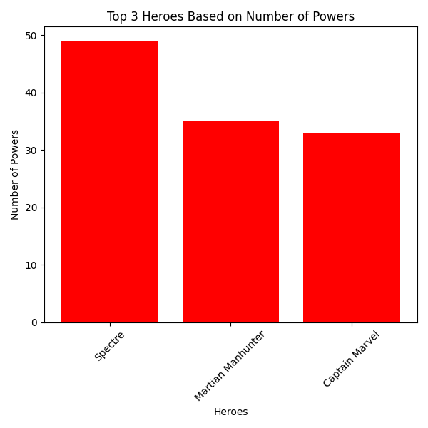
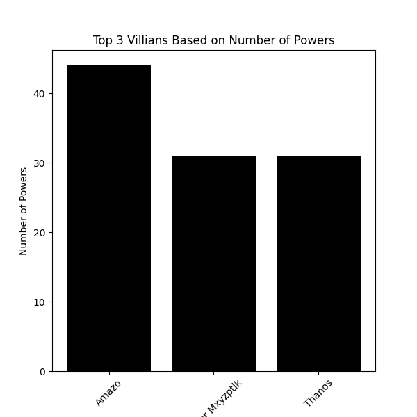

# Project 01: Finding the Most Powerful Superhero, Villain, and Antihero

Who's the most powerful? Let's find out.

## Data
- **Source**: [Superhero Dataset](https://www.kaggle.com/datasets/claudiodavi/superhero-set/data)
- **Description**: Info on 700+ characters with attributes like alignment, intelligence, strength, speed, durability, power, and combat skills.

### Data Fields:
- **Name**:
- **Alignment**: Hero, villain, or antihero.
- **Intelligence**: 
- **Strength**: 
- **Speed**:
- **Durability**:
- **Power**: 
- **Combat**: 
- and more...........

## Steps Performed
1. **Data Cleaning**: Handled missing values and removed duplicates.
2. **EDA**: Summary stats and segmented analysis by alignment.
3. **Visualization**:bar charts for top characters.

4. **Insights**: Top characters by power and alignment.

## Key Results
- **Most Powerful Superhero**: Spectra from DC
- **Most Powerful Villain**: Amazo from DC
- **Most Powerful Antihero**: Galactus from Marvel

