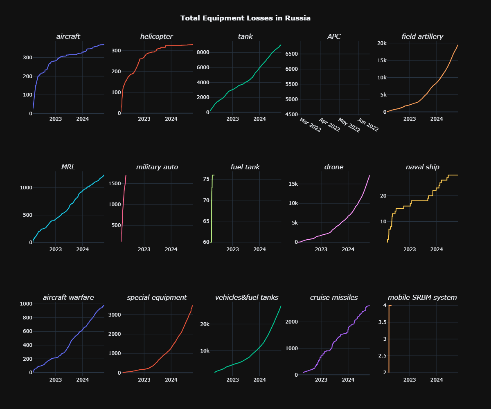
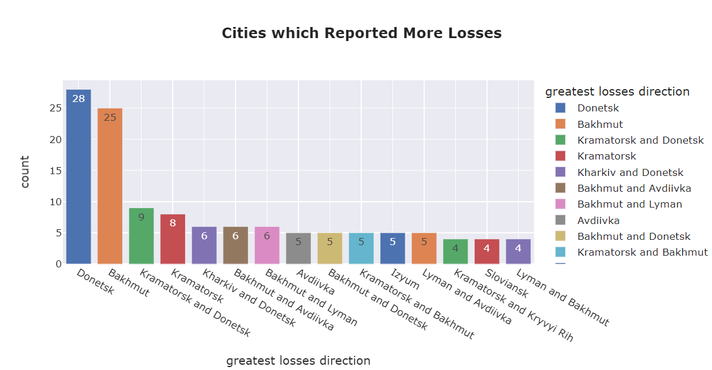

# Project 02: Analyzing Russia Ukraine War

> Let's see how much Ukarine Effected in war ?? POV : Russia

## Data
- **Source**: [Ukraine Vs Russia War Dataset](https://www.kaggle.com/datasets/piterfm/2022-ukraine-russian-war)
- **Description**: Detailed Data of russia losses Equipments Personnel.
> [Equipment](./data/russia_losses_equipment.csv)  
> [Personnel](./data/russia_losses_personnel.csv)

## Key Results

 From the Analysis, The Most Equipment Losses take place in Donetsk city of Ukraine. Ukraine has lost control of 20 percent of its territory to Russian forces and their proxies in recent years. The destruction has already cost Ukraine at least 113.5 billion, and it may need more than 200 billion to rebuild. Donor nations have pledged to give Ukraine more than 83 billion in total.

