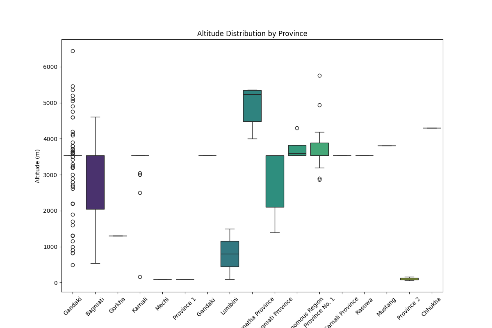
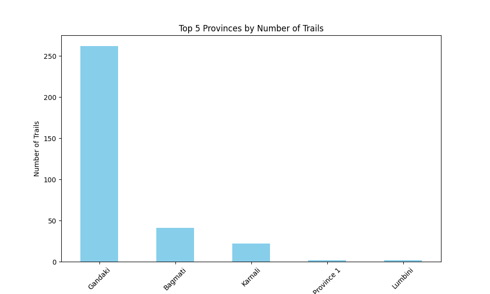
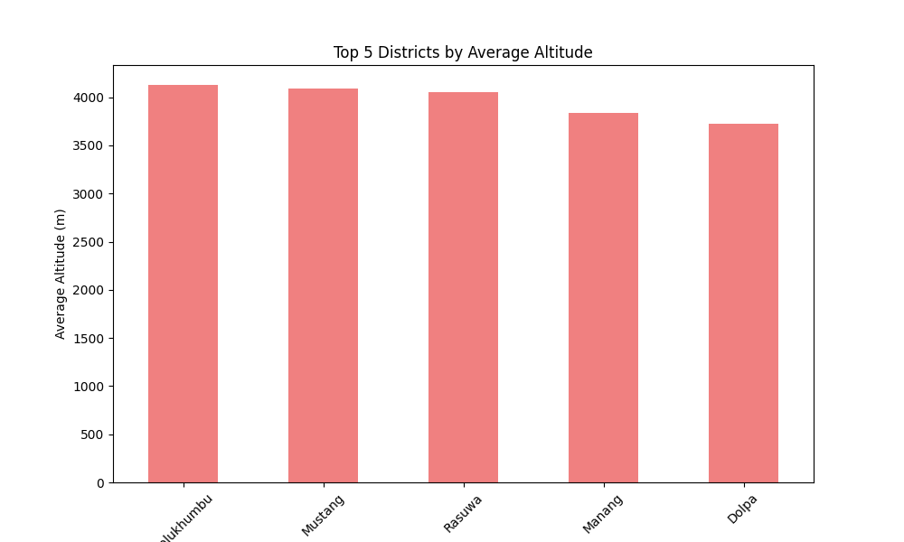
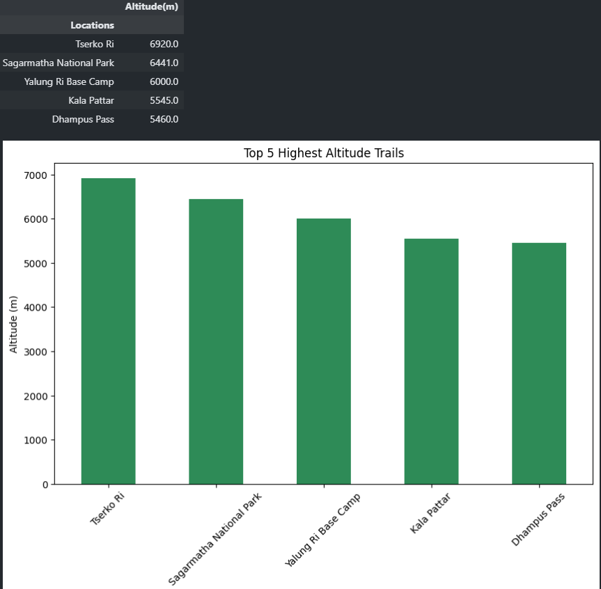
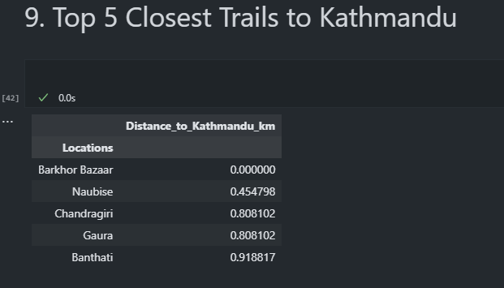

# Project 03: Finding the Highest Trails and trails Trails Nearest From Kathmandu

Once a friend of mine said " Let's go to Trekking" The idea arises, and here is the idea !!

## Data:
- **Source**: [Nepal Trails Dataset]()
- **Description**: Info on trails over the nepal categorized with Locations, country, province, District, Longitude, Latitude and Altitude

## Key Results:
1. *Gandaki province seems to have more trails with higher altitude, also found some outliers there*

2. *Generally, Gandaki Province have trails with higher altitude, followed by Karnali and Bagmati*

3. *Gandaki Province has the highest number of trails followed By Bagmati. shockingly aobut 200 trails of gap between Gandaki and Bagmati*

4. *District Solukhumbu has the highest average altitude followed by mustang, rasuwa and manang, suggesting it is suited for high-altitude trekkers*

5. *Found: Tserko Ri- 6920m the highest trail followed by Sagarmatha National Park -6441m*

6. *Found Nearest trails from Kathmandu*

***And a small notice: We going to Naubise Treking next Satarday***