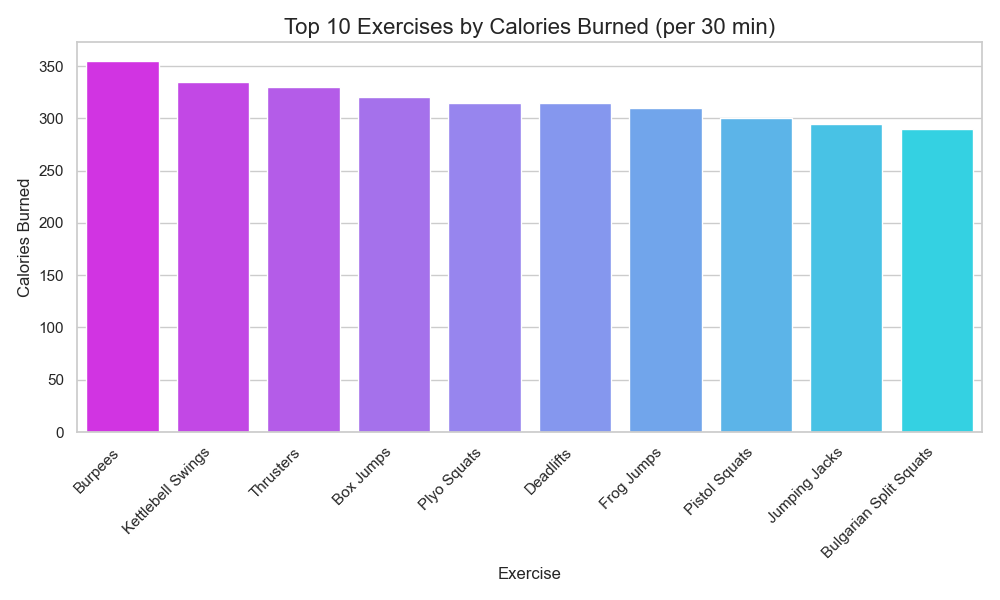
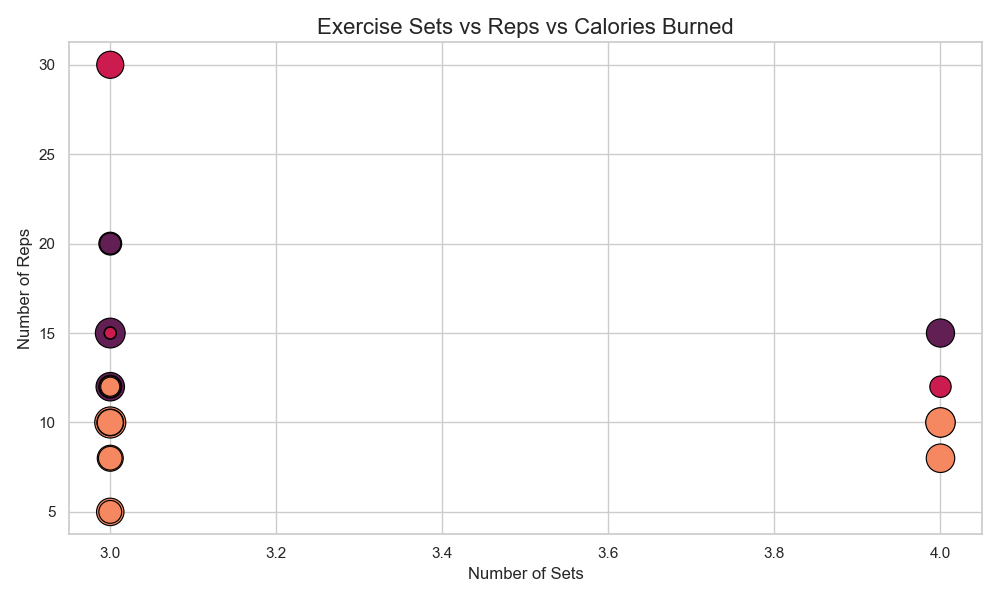
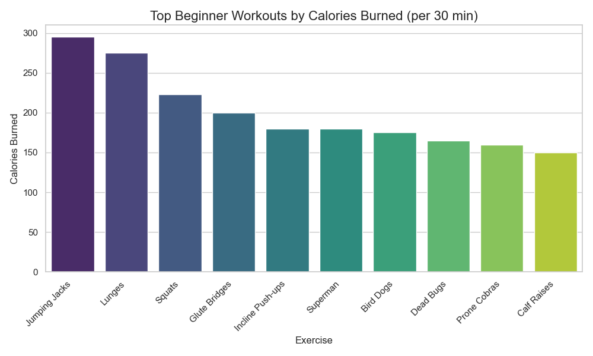

# Project 04: Best 50 Exercises
in a world where health challenges are prevalent, let's analyze the workouts for the best fit for you !!!

## Data:
- **Source**: [Best 50 Exercise for your body](https://www.kaggle.com/datasets/prajwaldongre/best-50-exercise-for-your-body)
- **Description**: This dataset provides detailed information on 50 diverse exercises designed to promote overall health and fitness. It includes a wide range of activities suitable for beginners to advanced fitness enthusiasts, targeting various muscle groups and fitness goals. The data can be used for personal fitness planning, workout app development, or data analysis projects in health and sports science.

## Key Result:
- Most exercises are **intermediate level**.
- Missing 'Equipment Needed' values marked as **NEN** (No Equipment Needed).
- **Top 10 calorie-burners** visualized—showing the best for max burn.

- **Calories vs. Sets/Reps**: Scatter plot shows the higher the sets/reps, the higher the burn, with colors indicating difficulty.

- Radar charts for exercises like **Push-ups** and **Burpees**—see their benefits in one view.
- **Beginner-friendly** no-equipment workouts identified—easy but effective options.

- **Top beginner workouts** for calorie-burn highlighted.
- Exercises categorized by **target muscle groups** for easy selection.
- A **day-by-day workout plan** crafted for balanced gains and daily calorie tracking.

